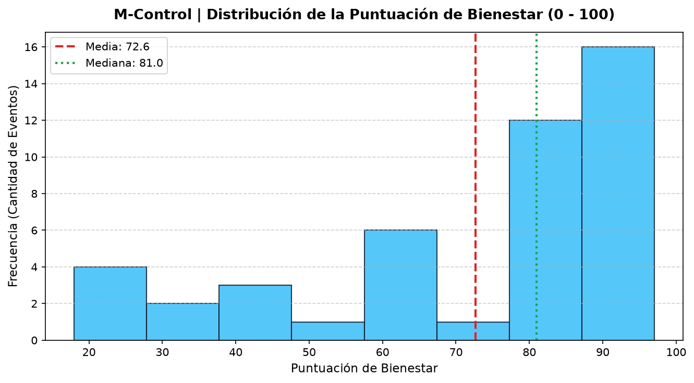
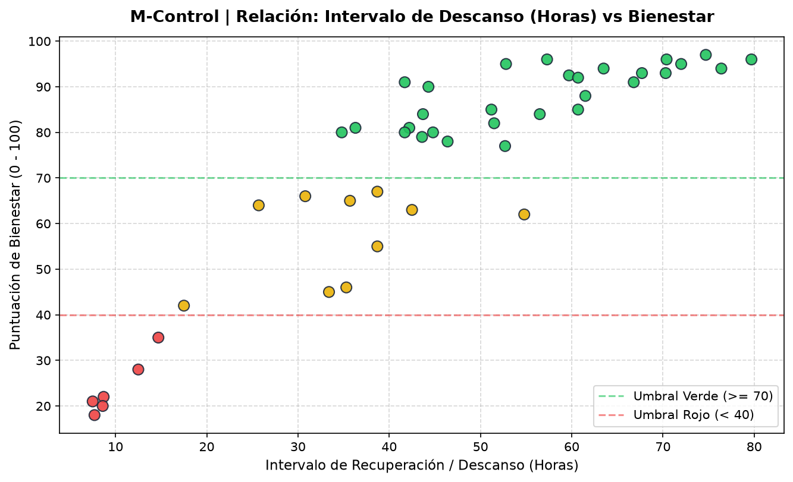
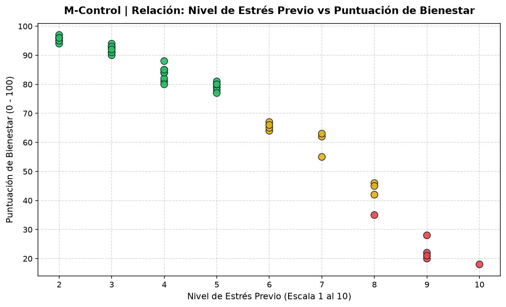

# M-Control | Plataforma de Autorregulación y Bienestar Masculino

[](https://laravel.com)
[](https://www.php.net/)
[](https://www.docker.com/)
[](https://www.sqlite.org/)
[](tests/Feature/MControlTest.php)

Plataforma web de autorregulación y monitoreo del bienestar masculino, sustentada en evidencia médica oficial y criterios clínicos internacionales (**Organización Mundial de la Salud - ICD-11 CSBD**, **Sociedad Internacional de Medicina Sexual - ISSM** y **Cleveland Clinic**).

El sistema rechaza la pseudociencia, los conteos punitivos de abstinencia y el sentimiento de culpa, ofreciendo un enfoque holístico de salud basado en la **interferencia funcional**, el **control autopercibido**, las **molestias físicas** y el **estrés emocional**.

---

## 🎯 Arquitectura del Proyecto

El sistema fue migrado y reestructurado como una aplicación **Full-Stack en Laravel**, desacoplada y contenerizada con Docker para convivir en paralelo con otros servicios (SGE y ProcessMaker):

* **Framework Backend:** Laravel 11 / PHP 8.3.
* **Motor Web:** Apache 2.4 con módulo `mod_rewrite` habilitado para URLs amigables.
* **Persistencia:** Base de datos **SQLite** (`database/database.sqlite`), eliminando dependencias de puertos externos y evitando cualquier colisión con MySQL o MariaDB.
* **Frontend:** Vistas dinámicas con Blade, interfaz basada en variables CSS nativas y evaluador reactivo en tiempo real para predicción de salud.
* **Contenedor:** Docker Compose en el puerto host **`8088`**.

---

## 🌐 Ecosistema de Puertos y Servicios

| Aplicación | Puerto Host | URL Local | Descripción / BD |
| :--- | :--- | :--- | :--- |
| **M-Control (Laravel)** | **`8088`** | `http://localhost:8088` | SQLite autónoma (`database/database.sqlite`) |


---

## 🚀 Módulos Implementados

### 1. Panel Principal (`/` o `/dashboard`)
* Visualización del semáforo actual y puntuación de bienestar (0 a 100).
* Métricas de actividad en 7 y 30 días.
* Cálculo del intervalo de descanso promedio.
* Historial de registros recientes con indicación de fecha, notas y estado.

### 2. Registro de Eventos Inteligente (`/events/create`)
* Selector de fecha y hora ajustado automáticamente al momento actual.
* Valoración multidimensional:
  * **Control Autopercibido:** Alto, Medio, Bajo.
  * **Interferencia Funcional:** Ninguna, Leve, Significativa (afectación de trabajo o sueño).
  * **Síntomas o Molestias Físicas:** Sin molestias, Leve irritación, Dolor notorio.
  * **Estrés / Tensión Previa:** Bajo (Calma), Medio, Alto (Escape emocional).
  * **Consumo de Pornografía:** Variable optativa para analizar correlaciones.
  * **Notas Personales:** Campo libre de observaciones.
* **Live Preview en Tiempo Real:** Algoritmo dinámico en el navegador que anticipa el semáforo y la puntuación antes de guardar.
* Redirección opcional hacia el Calendario o hacia el Panel de Métricas.

### 3. Calendario de Autorregulación (`/calendar`)
* Matriz mensual interactiva con cálculo de días y navegación entre meses anterior y siguiente.
* Identificación cromática en cada día con registros:
  * 🟢 **Verde:** Balance óptimo y bienestar preservado.
  * 🟡 **Amarillo:** Observar contexto o intervalo acelerado.
  * 🔴 **Rojo:** Recomendación de pausa y descanso (no prohibitivo).
* **Modal Descriptivo:** Al hacer clic en cualquier día, despliega los registros detallados de esa fecha.
* Tabla completa de historial con acción de eliminación directa protegida por CSRF.

### 4. Métricas y Análisis Estadístico (`/analysis`)
* Indicadores temporales de volumen en 7, 14, 30 y 90 días.
* **Barra Compuesta de Distribución:** Porcentaje y cantidad exacta de eventos en zona Verde, Amarilla y Roja.
* Análisis de cadencia: Tiempo transcurrido desde el último evento e intervalo promedio.
* Diagnóstico algorítmico adaptativo según el patrón detectado.
* Matriz oficial de pesos y criterios clínicos de la OMS e ISSM.

### 5. Biblioteca Científica y Evidencia (`/education`)
* Sección de **Mitos vs. Realidad Médica**: Desmitificación de falsas creencias populares (daños físicos inexistentes, retención seminal, mitos de abstinencia obligatoria).
* Beneficios respaldados por la literatura clínica (reducción de tensión, mejora del sueño).
* Señales de alerta para derivación profesional (ICD-11 CSBD).
* Acordeón interactivo de Preguntas Frecuentes (FAQ).
* Contacto y orientación con especialidades médicas (Urología, Sexología Clínica, Psicología).

### 6. Privacidad y Soberanía de Datos (`/privacy`)
* Principios de privacidad ética: Cero venta de datos y almacenamiento autónomo.
* Configuración del objetivo personal (Autorregulación, Reducción u Observación).
* **Modo Camuflaje Visual:** Oculta cifras sensibles en pantalla para proteger la privacidad visual.
* **Exportación Total en JSON:** Descarga de copia de seguridad con todos los eventos y marcas temporales.
* Acciones de restablecimiento a datos de prueba o borrado total definitivo.

---

## ⚖️ Algoritmo de Puntuación de Bienestar (0 - 100)

El puntaje se evalúa de acuerdo con la siguiente ponderación:

| Factor Clínico | Peso | Criterio de Descuento |
| :--- | :---: | :--- |
| **Interferencia Funcional** | **35%** | Severa (-35 pts) / Leve (-15 pts) |
| **Control Autopercibido** | **30%** | Bajo control impulsivo (-30 pts) / Medio (-10 pts) |
| **Síntomas Físicos** | **25%** | Dolor o irritación notoria (-25 pts) / Leve molestia (-15 pts) |
| **Estrés Previo** | **15%** | Alto nivel de ansiedad (-12 pts) |
| **Intervalo Histórico** | **15%** | Frecuencia menor a 12h (-15 pts) / menor a 24h (-8 pts) |

* **🟢 Verde:** Puntuación $\ge 70$, sin síntomas severos ni pérdida de control.
* **🟡 Amarillo:** Puntuación entre $40$ y $69$, o señales transitorias de tensión.
* **🔴 Rojo:** Puntuación $< 40$, o presencia de interferencia grave / dolor físico.

---

## 📊 Análisis Exploratorio de Datos (EDA) y Módulo de IA

En cumplimiento con los requerimientos académicos de las clases de Inteligencia Artificial (**Clase 3** y **Clase 4**), el proyecto incluye un pipeline completo de procesamiento de datos en Python, análisis estadístico vectorizado con **NumPy** y visualizaciones exploratorias con **Matplotlib**.

### 1. Variables Analizadas (`datos_mcontrol.csv`)
Se recolectaron y estructuraron registros longitudinales multidimensionales:
* **`intervalo_horas`** (Numérica continua): Horas de recuperación entre eventos consecutivos.
* **`puntuacion_bienestar`** (Numérica continua, 0-100): Índice clínico multidimensional.
* **`nivel_estres`** (Numérica discreta, 1-10): Escala de tensión psicológica y física previa.
* **`control_autopercibido`** (Ordinal, 1 a 3): Autodeterminación (Bajo, Medio, Alto).
* **`interferencia_funcional`** (Ordinal, 0 a 2): Afectación de obligaciones, estudio o sueño.
* **`sintomas_fisicos`** (Ordinal, 0 a 2): Molestias o irritación física.
* **`consumo_pornografia`** (Binaria, 0 o 1): Presencia de estímulos audiovisuales digitales.
* **`estado_semaforo`** (Categórica): Clasificación preventiva de salud (**Verde**, **Amarillo**, **Rojo**).

### 2. Estadísticas Descriptivas Obtenidas (NumPy)
Mediante el script [`eda_proyecto.py`](file:///C:/Users/USER/Documents/MControlPrueba/M-Control-IA/eda_proyecto.py) se calcularon vectorialmente con NumPy:

| Variable | Media (`np.mean`) | Mediana (`np.median`) | Desv. Estándar (`np.std`) | Mínimo (`np.min`) | Máximo (`np.max`) |
| :--- | :---: | :---: | :---: | :---: | :---: |
| **`intervalo_horas`** | **45.30 h** (~1.9 días) | **44.30 h** | **19.63 h** | **7.50 h** | **79.70 h** |
| **`puntuacion_bienestar`** | **72.63 pts** | **81.00 pts** | **23.82 pts** | **18.00 pts** | **97.00 pts** |
| **`nivel_estres`** | **4.96 / 10** | **4.00 / 10** | **2.33 pts** | **2.00 / 10** | **10.00 / 10** |

*Adicionalmente, el **64.4%** de los registros se ubicaron en estado Verde, el **22.2%** en Amarillo y el **13.3%** en Rojo; con una interferencia funcional presente en el **35.6%** de los eventos.*

### 3. Patrones y Relaciones Observadas en los Gráficos


* **Histograma de Bienestar (`histograma_bienestar.png`):** Muestra un sesgo hacia valores altos (mediana de 81 pts frente a una media de 72.6 pts), confirmando que en condiciones normales la conducta es saludable y preserva el bienestar, con una cola izquierda correspondiente a episodios aislados de repetición compulsiva.


* **Intervalo de Descanso vs. Bienestar (`dispersion_intervalo_bienestar.png`):** Existe una correlación positiva directa y asintótica: descansos superiores a **36 - 48 horas** garantizan puntuaciones en zona verde (bienestar $\ge 70$), mientras que intervalos inferiores a **15 horas** caen invariablemente en zonas amarilla y roja.


* **Nivel de Estrés vs. Bienestar (`dispersion_estres_bienestar.png`):** Correlación negativa clara: niveles de estrés elevados ($> 7/10$) actúan como detonante de pérdida de control autopercibido e interferencia, precipitando la caída del puntaje de bienestar.

### 4. Influencia en el Futuro Modelo de IA
Estos hallazgos determinan directamente la arquitectura de Inteligencia Artificial que se implementará en los siguientes cortes:
1. **Modelo de Clasificación Preventiva (Random Forest / Regresión Logística):** Entrenar un modelo supervisado que anticipe el estado del semáforo preventivo antes de que el usuario registre el evento, sugiriendo pausas activas cuando la combinación de intervalo corto y alto estrés indique alta probabilidad de caída en semáforo rojo.
2. **Recomendador Adaptativo de Intervalos Óptimos:** Utilizar modelos de regresión o agrupamiento (Clustering K-Means) para aprender el ritmo biológico individual del usuario, sugiriendo períodos de recuperación personalizados sin caer en prescripciones rígidas universales.

### 5. Ejecución del Módulo de IA (Scripts de las Clases 3 y 4)
Para ejecutar los análisis localmente:
```bash
# Actividad Clase 3: Lectura, estadísticas y generación de informe_proyecto.md
python analisis_proyecto.py

# Actividad Clase 4: Análisis exploratorio con NumPy y generación de gráficos PNG
python eda_proyecto.py
```
O mediante el servicio Docker de IA configurado en `docker-compose.yml`:
```bash
docker compose run --rm python_ia python eda_proyecto.py
```

---

## 🛠️ Instalación y Despliegue Local

### Requisitos
* Docker Desktop con integración WSL2 (o Linux nativo).
* Git.

### Pasos de Ejecución:

1. **Clonar el repositorio y situarse en el directorio:**
   ```bash
   git clone https://github.com/NiquelAwol/M-Control-IA.git
   cd M-Control-IA/mcontrol
   ```

2. **Levantar el contenedor con Docker Compose:**
   ```bash
   docker compose up -d --build
   ```

3. **Ejecutar migraciones y datos de prueba:**
   ```bash
   docker exec mcontrol_web php artisan migrate:fresh --seed --force
   ```

4. **Acceder a la aplicación:**
   Abre en tu navegador: [http://localhost:8088](http://localhost:8088)

5. **Ejecución de Pruebas Automatizadas:**
   ```bash
   docker exec mcontrol_web php artisan test --filter=MControlTest
   ```
   *Resultado esperado: 7 tests aprobados (18 aserciones).*

---

## 📜 Historial de Commits Seccionados (`mi-rama-de-trabajo`)

El trabajo se estructuró en commits atómicos organizados por módulo para facilitar la auditoría y revisión en el Pull Request:

1. `feat(core, dashboard)`: Arquitectura Laravel, Dockerfile PHP 8.3, SQLite, layout maestro y panel principal.
2. `feat(registro)`: Formulario inteligente de eventos, preview interactivo y algoritmo de evaluación.
3. `feat(calendario)`: Matriz mensual interactiva con estados de semáforo y modal descriptivo.
4. `feat(analisis)`: Métricas temporales (7/14/30/90 días), distribución de semáforo y matriz ponderada OMS/ISSM.
5. `feat(educacion, privacidad, tests)`: Módulo científico, gestión de datos, exportación JSON y suite de tests automatizados.
6. `chore(mcontrol)`: Scaffolding auxiliar, configuraciones de assets y tests unitarios base.
